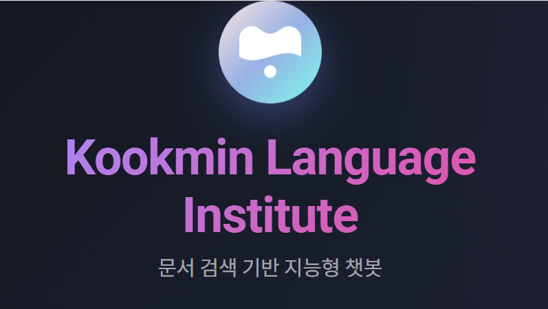
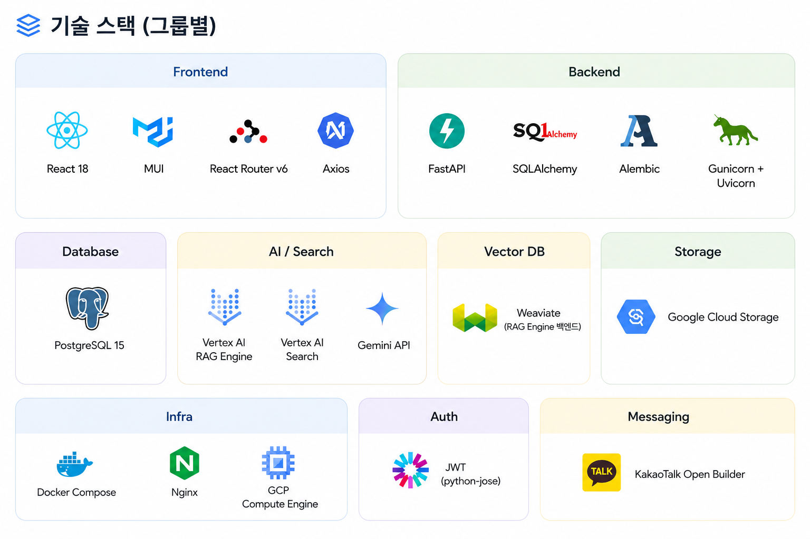
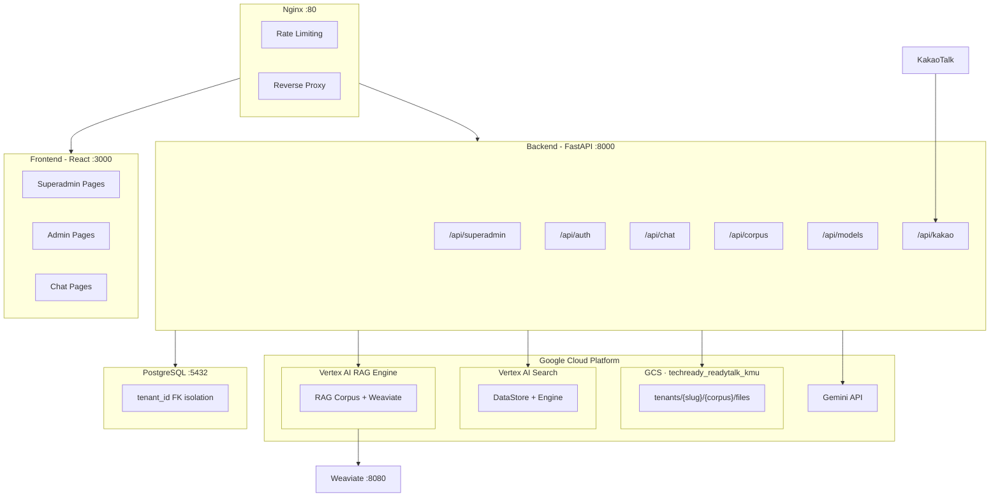

# 🎓 산학 캡스톤 22조 : ReadyTalk for Academy

<p align="center">
  <a href="https://academy.ready.talk/kookmin-language-institute">
    
  </a>
</p>

<p align="center">
  <b>AI 기반 교육기관 맞춤형 멀티테넌트 학원 운영 플랫폼</b>
</p>

<p align="center">
  🔗 <sub>이미지를 클릭하면 서비스 페이지로 이동합니다.</sub>
</p>

---

## 📚 목차

- [1. 프로젝트 소개](#1-프로젝트-소개)
- [2. 소개 영상](#2-소개-영상)
- [3. 팀 소개](#3-팀-소개)
- [4. 기술 스택](#4-기술-스택)
- [5. 시스템 아키텍처](#5-시스템-아키텍처)
- [6. 핵심 기술 구조](#6-핵심-기술-구조)
- [7. 폴더 구조](#7-폴더-구조)
- [8. 개발 환경 및 실행 방법](#8-개발-환경-및-실행-방법)
---

# 1. 프로젝트 소개

## 📌 프로젝트 개요

**ReadyTalk for Academy**는 학원 운영 자동화와 AI 상담 기능을 통합한 멀티테넌트 기반 교육기관 지원 플랫폼입니다.

비인증 사용자에게는 상담 매뉴얼 기반 안내와 행동 유도를 제공하고, 인증된 사용자에게는 출결 관리, 수업 일정, 리포트 등 개인화된 서비스를 제공합니다.

또한 기출 문제 유형 분류 및 유사 문제 생성을 통해 학습을 지원하며, 관리자는 상담 내용을 저장·요약하여 운영 효율을 높일 수 있습니다.

---
## 🚀 프로젝트 차별점 및 핵심 기능

ReadyTalk for Academy는 단순 AI 챗봇이 아닌,
교육기관 운영에 특화된 AI 기반 학원 지원 플랫폼입니다.

멀티테넌트 구조를 통해 학원별 데이터를 독립적으로 관리할 수 있으며,
RAG 기반 문서 검색과 Function Calling 기반 AI 처리 구조를 활용하여
상담, 문서 검색, 사용자 관리 등 실제 학원 운영 업무를 지원하도록 개발하였습니다.

| 기능 | 설명 |
|---|---|
| RAG 기반 AI 상담 | 문서 기반 검색 및 응답 제공 |
| 멀티테넌트 구조 | 학원별 독립 데이터 관리 |
| KakaoTalk 연동 | 카카오톡 상담 지원 |
| 관리자 기능 | 문서 업로드· 사용자 · 문서저장소 관리 |

---
## 🖼️ 주요 서비스 화면

🔴 [메인 채팅 화면 이미지 첨부]

🔴 [어드민 페이지 이미지 첨부]

🔴 [출결 관리 페이지 이미지 첨부]

---

# 2. 소개 영상

🔴 [소개 영상 링크 또는 썸네일 삽입]

---

# 3. 팀 소개

<table>
  <tr>
    <td align="center">
      <a href="https://github.com/yangjiwoong1">
        <br />
        <sub><b>양지웅</b></sub>
      </a><br />
      <sub>팀장 · 백엔드</sub>
    </td>
    <td align="center">
      <a href="https://github.com/ume24">
        <br />
        <sub><b>정유미</b></sub>
      </a><br />
      <sub>AI Agent 개발<br>프론트엔드</sub>
    </td>
    <td align="center">
      <a href="https://github.com/yunseo1011">
        <br />
        <sub><b>이윤서</b></sub>
      </a><br />
      <sub>AI Agent 개발</sub>
    </td>
    <td align="center">
      <a href="https://github.com/seungil0909">
        <br />
        <sub><b>양승일</b></sub>
      </a><br />
      <sub>문서 정리<br>개발 보조</sub>
    </td>
    <td align="center">
      <a href="https://github.com/hyeforest7">
        <br />
        <sub><b>유혜성</b></sub>
      </a><br />
      <sub>AI Agent QA</sub>
    </td>
  </tr>
</table>

---

# 4. 기술 스택

<p align="center">
  
</p>

---

# 5. 시스템 아키텍처




---

# 6. 핵심 기술 구조
본 시스템은 학원별 독립 데이터 관리와 AI 기반 문서 검색 기능을 위해 멀티테넌트 구조와 Function Calling 기반 AI 처리 구조로 설계되었습니다.

## 6.1 검색 엔진 이중 지원 구조
테넌트별로 검색 엔진을 선택할 수 있습니다:

| 엔진 | 서비스 | 리소스 구조 | 용도 |
|------|--------|------------|------|
| **RAG Engine** (기본) | `rag_service.py` | ragCorpora → ragFiles | Weaviate 하이브리드 검색 |
| **Vertex AI Search** | `search_service.py` | dataStores → engines | Google 관리형 검색 |

```python
# tenant.search_backend 필드로 선택
"rag_engine"       # Vertex AI RAG + Weaviate
"vertex_ai_search" # Vertex AI Search (DataStore + Engine)
```

## 6.2 멀티테넌트 데이터 구조

### 테넌트 격리 방식

모든 테이블에 `tenant_id` FK를 부여하여 데이터베이스 레벨에서 격리합니다.

```
tenants
  ├── users (tenant_id FK)
  ├── groups (tenant_id FK)
  ├── corpora (tenant_id FK)
  │     └── documents (tenant_id FK)
  ├── chat_sessions (tenant_id FK)
  │     └── messages (tenant_id FK)
  ├── tenant_gcp_configs (1:1)
  ├── tenant_kakao_configs (1:1)
  ├── tenant_calendar_configs (1:1)
  └── chatbot_settings (1:1)
```

---

## 6.3 GCP 리소스 구조

**1 GCP 프로젝트, 1 GCS 버킷, N 테넌트** 구조:

```
GCP Project: techready-readytalk-kmu
│
├── Vertex AI RAG (asia-northeast3)
│   ├── ragCorpora/xxx  ← 테넌트A (RAG Engine)
│   └── ragCorpora/yyy  ← 테넌트B (RAG Engine)
│
├── Vertex AI Search (global)
│   ├── dataStores/aaa + engines/aaa  ← 테넌트C (Vertex AI Search)
│   └── dataStores/bbb + engines/bbb  ← 테넌트D (Vertex AI Search)
│
├── Weaviate (Docker, weaviate-kmu.ready.talk)
│   └── Collection per RAG Corpus
│
└── GCS Bucket: techready_readytalk_kmu
    └── tenants/
        ├── tenant-a/
        │   └── corpus-name/
        │       └── files...
        └── tenant-b/
            └── corpus-name/
                └── files...
```

---

## 6.4 사용자 권한 구조

```
Superadmin (tenant_id=NULL, is_superadmin=True)
│  플랫폼 전체 관리: 테넌트 CRUD, GCP 설정, 기본 모델 설정
│
├── Tenant Admin (is_admin=True)
│   │  테넌트 내 관리: 문서저장소, 문서 업로드/삭제, 사용자 관리
│   │
│   ├── Regular User (그룹: 관리자/일반)
│   │     채팅, 파일 업로드, 세션 관리
│   │
│   └── Guest User (auth_provider=guest)
│         채팅만 가능, 파일 업로드 불가
│
└── KakaoTalk User (auth_provider=kakao)
      카카오톡 채널 통해 자동 생성, 채팅만 가능
```

---

## 6.5 AI 응답 처리 흐름

```
사용자 질문
    │
    ▼
모델 결정 (user.preferred_model > DEFAULT_MODEL)
    │
    ▼
query_smart() — Gemini Function Calling
    │
    ├── search_documents() → RAG Corpus 검색 (top_k=5)
    ├── search_web()       → Google Search (web_search_enabled 시)
    ├── list/create/update/delete_calendar_events() → Google Calendar
    └── (none)             → 일반 대화
    │
    ▼
응답 생성 + 출처 추출
    │  - cited_sources에서 파일명 추출
    │  - DB에서 display_name 조회 (UUID→원본명)
    │  - GCS Signed URL 생성 (출처 링크)
    │
    ▼
DB 저장 (messages 테이블) → 응답 반환
```

---

## 6.6 Google Calendar 연동

테넌트별 Google Calendar OAuth 연동:

1. 테넌트 어드민이 캘린더 연동 (OAuth 2.0)
2. 챗봇에서 자연어로 일정 관리 (Function Calling)
   - "이번 주 일정 알려줘" → `list_calendar_events`
   - "내일 3시에 미팅 잡아줘" → `create_calendar_event`
   - "회의 시간 변경해줘" → `update_calendar_event`
   - "미팅 취소해줘" → `delete_calendar_event`

---

## 6.7 KakaoTalk 연동

```
카카오톡 사용자 → 카카오 서버 → /api/kakao/skill (webhook)
                                    │
                                    ├── 사용자 자동 생성/조회
                                    ├── Function Calling 기반 스마트 쿼리
                                    ├── 응답 분할 (1000자 × 최대 3개 말풍선)
                                    └── Callback URL로 비동기 응답
```

---

## 6.8 Superadmin 관리 구조

### Platform Settings

| 키 | 설명 |
|----|------|
| `VERTEX_AI_PROJECT_ID` | GCP 프로젝트 ID |
| `VERTEX_AI_LOCATION` | Vertex AI 리전 |
| `GCP_CREDENTIALS_PATH` | 서비스 계정 JSON 경로 |
| `GCS_BUCKET_NAME` | GCS 버킷명 |
| `GEMINI_API_KEY` | Gemini API 키 |
| `DEFAULT_MODEL` | 기본 AI 모델 |
| `WEAVIATE_HTTP_ENDPOINT` | Weaviate 엔드포인트 |
| `WEAVIATE_COLLECTION_NAME` | Weaviate 컬렉션명 |
| `WEAVIATE_API_KEY_SECRET` | Secret Manager 시크릿 경로 |

### Tenant Lifecycle

**생성 시 자동 프로비저닝:**
1. Tenant 레코드 생성 (name, slug, search_backend)
2. GCP Config 생성 (공용 프로젝트/버킷 연결)
3. 기본 그룹 생성 (관리자, 일반)
4. 관리자 계정 자동 생성
5. GCS에 테넌트 폴더 생성

**삭제 시 Cascade Cleanup:**
1. Vertex AI RAG Corpus 또는 Search DataStore/Engine 삭제
2. GCS 테넌트 폴더 및 하위 파일 삭제
3. DB Cascade 삭제


---
# 7. 폴더 구조
```
readytalk-kmu/
├── backend/
│   ├── app/
│   │   ├── models/        # Tenant · User · Chat 등 DB 모델
│   │   ├── routers/       # 인증 · 채팅 · 문서 · 관리자 API
│   │   ├── services/      # RAG · Gemini · 검색 엔진 로직
│   │   ├── schemas/       # Pydantic 스키마
│   │   └── utils/         # 인증 · 보안 · 권한 관리
│   │
│   ├── migrations/        # Alembic DB 마이그레이션
│   ├── credentials/       # GCP 서비스 계정 키 (gitignore)
│   └── Dockerfile
│
├── frontend/
│   ├── src/
│   │   ├── pages/         # 채팅 · 관리자 
│   │   ├── services/      # Axios API 클라이언트
│   │   └── context/       # 인증 · 테넌트 상태 관리
│   │
│   └── Dockerfile
│
├── nginx/
│   └── backend.conf       # Reverse Proxy 설정
│
├── docker-compose.yml
├── docker-compose.dev.yml
├── docker-compose.prod.yml
└── .env
```
---


# 8. 개발 환경 및 실행 방법

## 📦 Quick Start

### Prerequisites

- Docker & Docker Compose
- GCP 서비스 계정 (Vertex AI + GCS + Secret Manager 권한)
- (선택) Google Calendar OAuth 클라이언트
- (선택) 카카오톡 오픈빌더 계정

### 1. 환경 설정

```bash
cp .env.example .env
# .env 파일 편집
```

### 2. GCP 서비스 계정

```bash
mkdir -p backend/credentials
cp your-service-account.json backend/credentials/readytalk-kmu-credentials.json
```

### 3. 실행

```bash
docker-compose up -d --build
```

### 4. 접속

| URL | 설명 |
|-----|------|
| http://localhost:8888 | 메인 |
| http://localhost:8888/superadmin | 슈퍼어드민 |
| http://localhost:8888/{slug}/chat | 테넌트별 채팅 |
| http://localhost:8888/{slug}/admin | 테넌트별 어드민 |

### 5. 초기 설정 순서

1. 슈퍼어드민 로그인 (`admin@academy.ready.talk`)
2. 설정 > GCP 설정 입력
3. 설정 > 기본 모델 선택
4. 테넌트 생성 (검색 엔진 선택: RAG Engine 또는 Vertex AI Search)
5. 테넌트 어드민 → 문서저장소 생성 → 파일 업로드
